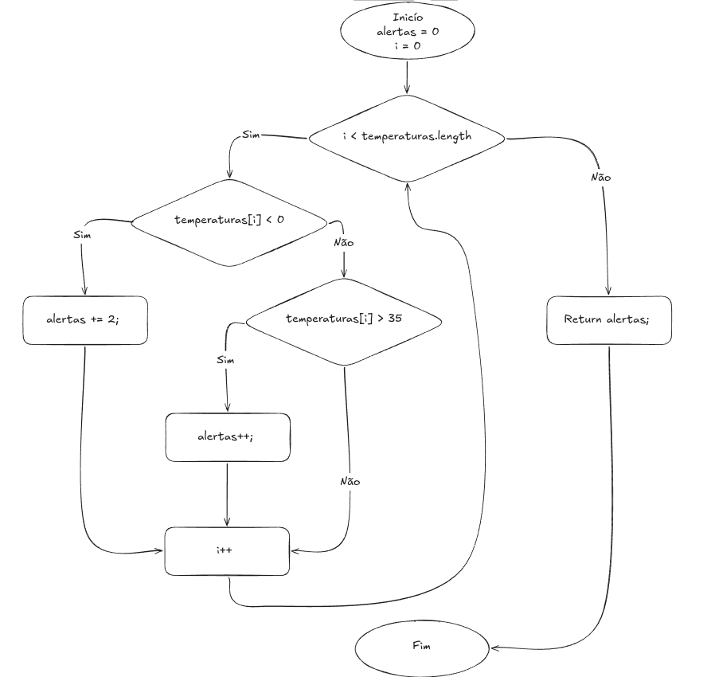

# Exercício 2: Análise de leituras de temperatura

## 1. Blocos básicos e decisões

|  Nó | Bloco básico / ação                                         |
| --: | ----------------------------------------------------------- |
|   1 | Início do método e inicializações: `alertas = 0` e `i = 0`. |
|   2 | Decisão D1 (laço): `i < temperaturas.length`.               |
|   3 | Decisão D2: `temperaturas[i] < 0`.                          |
|   4 | Atribuição: `alertas += 2`.                                 |
|   5 | Decisão D3: `temperaturas[i] > 35`.                         |
|   6 | Atribuição: `alertas++`.                                    |
|   7 | Incremento do laço: `i++`.                                  |
|   8 | Retorno: `return alertas`.                                  |
|   9 | Fim do método.                                              |

As três decisões ocorrem nos nós 2, 3 e 5. A saída **T** significa condição verdadeira e **F**, falsa.

## 2. Grafo de Fluxo de Controle

## 3. Nós, arestas e complexidade ciclomática

As arestas do grafo são:

`1 -> 2`, `2 -> 3`, `2 -> 8`, `3 -> 4`, `3 -> 5`, `4 -> 7`, `5 -> 6`, `5 -> 7`, `6 -> 7`, `7 -> 2` e `8 -> 9`

- Número de nós: **N = 9**.
- Número de arestas: **E = 11**.
- `V(G) = E - N + 2 = 11 - 9 + 2 = 4`.
- Há três decisões lógicas; portanto, `V(G) = 3 + 1 = 4`.

Os dois cálculos coincidem: a complexidade ciclomática é **4**.

## 4. Base de caminhos independentes e casos de teste

| Caminho | Sequência de nós                                        | Entrada (`temperaturas`) | Resultado esperado | Cenário exercitado                 |
| ------- | ------------------------------------------------------- | ------------------------ | ------------------ | ---------------------------------- |
| P1      | `1 -> 2(F) -> 8 -> 9`                                   | `new double[]{}` (vazio) | `0`                | Saída do laço sem nenhuma iteração |
| P2      | `1 -> 2(T) -> 3(T) -> 4 -> 7 -> 2(F) -> 8 -> 9`         | `new double[]{-5.0}`     | `2`                | Ramo de temperatura negativa       |
| P3      | `1 -> 2(T) -> 3(F) -> 5(T) -> 6 -> 7 -> 2(F) -> 8 -> 9` | `new double[]{40.0}`     | `1`                | Ramo de temperatura superior a 35  |
| P4      | `1 -> 2(T) -> 3(F) -> 5(F) -> 7 -> 2(F) -> 8 -> 9`      | `new double[]{20.0}`     | `0`                | Ramo de temperatura entre 0 e 35   |

_Cada caminho acrescenta pelo menos uma aresta não coberta:_

- P1 cobre a falha inicial do laço `2(F) -> 8`.
- P2 cobre a entrada no laço `2(T) -> 3` e a condição verdadeira do primeiro IF `3(T) -> 4`.
- P3 cobre a condição falsa do IF e a verdadeira do ELSE IF `3(F) -> 5(T) -> 6`.
- P4 cobre a condição em que a temperatura não aciona nenhum alerta `5(F) -> 7`.

## 5. Questões para discussão

**Um vetor com várias temperaturas percorre um único caminho ou pode repetir partes do grafo?**
Ele repete partes do grafo. Devido ao laço `while`, o fluxo retorna seguidamente ao nó de decisão 2 (`i < temperaturas.length`). Durante uma única execução do método com um vetor de múltiplos elementos, o fluxo transitará por diferentes ramos internos ciclicamente antes de concluir.

**Qual entrada permite sair do método sem acessar uma posição do vetor?**
Um vetor vazio (ex: `new double[]{}`). Isso faz com que a avaliação inicial `i < temperaturas.length` (0 < 0) já resulte em falso, pulando o corpo do laço inteiramente e evitando qualquer exceção de `IndexOutOfBounds`.

**Os testes dos valores `0` e `35` ajudam a avaliar quais fronteiras?**
Ajudam a avaliar a exatidão dos operadores relacionais (`<` e `>`). Ao testar `0`, garantimos que o alerta de temperatura negativa não seja acionado incorretamente (validando que é estritamente menor que zero). Ao testar `35`, garantimos que não haja falso positivo no alerta de temperatura alta (validando que o alerta só ocorre acima de 35, e não igual).

**Por que o `else if` deve ser representado como uma nova decisão?**
Porque ele não é uma simples instrução sequencial. Caso a primeira condição do `if` seja falsa, o fluxo é forçado a realizar uma nova avaliação booleana (uma nova ramificação/losango) para decidir se executa o incremento simples de alerta (`alertas++`) ou se ignora as atribuições e pula direto para o incremento do laço (`i++`).

**Por que o retorno do laço precisa aparecer no CFG?**
Sem a aresta de retorno (`7 -> 2`), o grafo não representaria uma estrutura de repetição cíclica, mas sim uma condicional simples contínua. Além disso, essa aresta conta para o total `E` (arestas). Sem ela, a fórmula de McCabe (`E - N + 2`) resultaria em uma complexidade ciclomática errada, ocultando a complexidade real adicionada pelo laço lógico.
